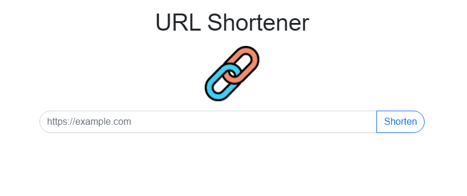
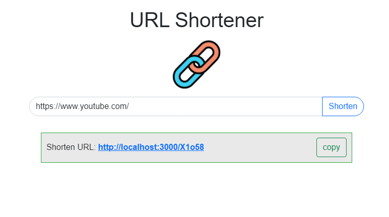

# URL Shortener

A web application based on Express.js.


## Screen Shot
--- 
### Home Page


### Result Page


## Features 
1. Shorten URL by application.
2. Copy shortened URL to clipboard.

## Requirement
1. Node.js (6.14.11 recommended)
2. Express.js (4.17.2 recommended)
3. Express-handlebars (5.3.5 recommended)
4. Mongoose (6.1.3 recommended)

## Installation
1. Open terminal and run command below
```
git clone https://github.com/lcy101u/url-shortener
```
2. Change current directory to url-shortener
```
cd url-shortener
```
3. Install required npm modules
```
npm install
```
4. (Required) Open MongoDB server and create database name url-shortener 
5. Open browser and type http://localhost:3000

## Cheat sheet 
1. Start this project
```
npm run start
```
2. Development mode
```
npm run dev
```
3. Run seeder
```
npm run seed
```

## Contributor
[Young](https://github.com/lcy101u)

